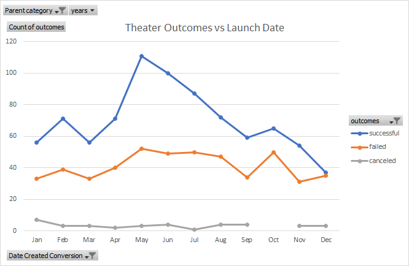
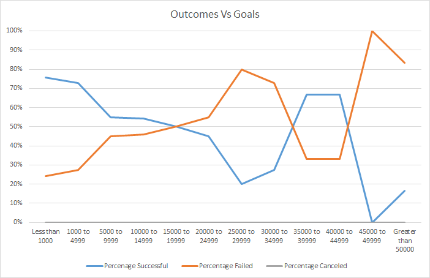

# Kickstarting with Excel

## Overview of Project

Louise wants to start a crowdfuning campaign for her new play Fever, she has estimated a budget of $10,000. She wants to know if there are specific factors that make a kickstarter campaign successful. We have a dataset of crowdfunding information from the website Kickstarter.  This is broken down into different types of crowdfuning projects and includes variables such as goal amount, pledged amount, country, how many backers and if the project was successfully funded or not.

### Purpose
The purpose is to identify factors that make a kickstarter campaign successful and provide this information to Louise so she can mirror these in her kickstarter.

## Analysis and Challenges
The Challenge was to analize outcomes of different campaigns in relation to their launch dates and funding goals. 

### Analysis of Outcomes Based on Launch Date
The graph below shows the kickstarter data filltered down to theater campaigns only. The Y axis is the number of campaigns and the x axis has the month of the launch date. The colors of each line indicates successful, failed and cancled campaign. 

### Analysis of Outcomes Based on Goals

The graph below shows the percent of each outcome compared to the goal of all of the campaigns for plays only. Percent of total campaign is on the Y axis and the goal of each campaign is on the x-axis. The colors of the line indicat the outcome of the campaign. 

### Challenges and Difficulties Encountered
One challenge that i encountered was with the outcomes vs goals campaign graph. My graph was initially similar to the expected output but not exact (see image below).

I checked my logic over and over again and it seemed correct so in office hours before class i asked if anyone else had similar issues and one person had the exact same problem as me and it made me feel like i was not wrong, but as the small group inspected our code another classmate noted we forgot to add the filter for "Plays" (see image below)
## Results

- What are two conclusions you can draw about the Outcomes based on Launch Date?

- What can you conclude about the Outcomes based on Goals?

- What are some limitations of this dataset?

- What are some other possible tables and/or graphs that we could create?
